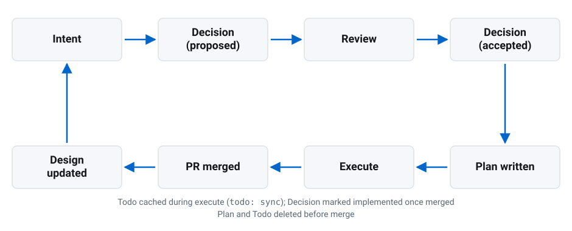

## The idea

Every project keeps a small set of markdown files in git that describe its
intent, its current state, and how it changes. They live at the same paths in
every repo, so a human or an agent can walk in cold and know where to look.
Two axes decide everything else: **lifetime** — how long a document stays
true — and **audience** — outsiders and machines read the repo root,
maintainers read `docs/`.

## What's different

The artifacts themselves are not new — a charter, a design document, an ADR
log, a roadmap, a runbook, an incident report each already has a home in some
existing practice, and a repo that adopted all of them piecemeal would end up
with a similar list of files. What this convention adds is three rules about
how those files behave over time:

- **A decision freezes when review ends.** `accept` and `reject` are the last
  writes to a record's body. A correction is a dated line in an append-only
  `## Errata` tail. A reversal is a new record, the superseded record gains
  an Errata pointer, and neither record's status changes. An editable
  decision log answers what the project currently believes, which is the
  Design document's job. A frozen one answers what was decided, when, and on
  what argument.
- **Lifetimes that expire are a commitment to delete.** Expiry is an event
  in the repository rather than a matter of judgment: a Backlog item is
  deleted by the change that implements it, in that pull request, together
  with its Roadmap entry, and an item that will not be implemented is
  deleted rather than kept; a Plan is deleted at `plan: done` and a Todo at
  `todo: clear`, both before merge; a Roadmap item that no longer applies
  is deleted rather than archived. Documentation decays because it only
  ever grows, and binding deletion to an event that was going to happen
  anyway is what keeps those files honest.
- **Bookkeeping commits are net-zero.** A `plan:` or `todo:` commit touches
  only its own artifact, so dropping every one of them leaves the tree exactly
  as it was and a squash merge erases them for free. An agent can checkpoint
  as often as it likes without putting that noise in the history a human
  reads.



## The artifacts

| Artifact                                  | Small repo   | Graduated                           | Lifetime              | Answers                                            |
| ----------------------------------------- | ------------ | ----------------------------------- | --------------------- | -------------------------------------------------- |
| [Charter](artifacts/charter/index.md)     | `CHARTER.md` | `docs/charter.md`                   | project               | why it exists, goals, route                        |
| [Roadmap](artifacts/roadmap/index.md)     | `ROADMAP.md` | `docs/roadmap.md`                   | living                | what's next, in order                              |
| [Plan](artifacts/plan/index.md)           | `PLAN.md`    | —                                   | one branch / worktree | exact steps for the current decision               |
| [Todo](artifacts/todo/index.md)           | `TODO.md`    | —                                   | one branch / worktree | where the work left off                            |
| [Design](artifacts/design/index.md)       | `DESIGN.md`  | `docs/design.md`                    | living                | what the system is and does _now_                  |
| [Events](events/index.md)                 | `EVENTS.md`  | `docs/events.md`                    | living                | which lifecycle events the repo's commits announce |
| [Backlog](artifacts/backlog/index.md)     | —            | `docs/backlog/<slug>.md`            | until done            | what one queued item is, in full                   |
| [Decisions](artifacts/decisions/index.md) | —            | `docs/decisions/YYYY-MM-DD-slug.md` | append-only           | what changed, why, what it cost                    |
| [Runbooks](artifacts/runbooks/index.md)   | —            | `docs/runbooks/<trigger>.md`        | living                | what to do when _x_ fires                          |
| [Incidents](artifacts/incidents/index.md) | —            | `docs/incidents/YYYY-MM-DD-slug.md` | append-only           | what broke, what we learned                        |

_Events is proposed, not settled: the vocabulary is in use, but `EVENTS.md`
as its home is
[still under review](https://github.com/phatblat/conventional-docs/blob/main/docs/decisions/2026-09-05-give-events-their-own-artifact.md)._

`README.md`, `LICENSE`, `CHANGELOG.md`, and `AGENTS.md` never graduate; the
[Changelog](artifacts/changelog/index.md) has a page of its own because the
convention fixes its shape.

## The loop



```text
intent → Decision (proposed) → review → Decision (accepted)
                                              ↓
   Design updated ← PR merged ← execute ← Plan written
                                Todo cached
   Plan and Todo deleted
```

A PR over ~100 lines, or one that changes behavior, a published interface, or a
dependency, needs a Decision before it merges. Work spanning more than one
session, or handed to another agent, needs a Plan.

## What this is not

- **Not user documentation.** Tutorials, how-tos, and reference docs are
  [Diátaxis](https://diataxis.fr/)'s territory. Where they overlap, Design is
  explanation/reference and runbooks are how-to.
- **Not a tool, but tooling helps.** Like [Keep a Changelog](https://keepachangelog.com/en/2.0.0/), this convention
  costs only attention to follow by hand — a CI check, the agent skill, and
  the [`doc` binary](doc/index.md) are all optional. All three are
  highly recommended once you adopt it: a required CI check is a checkpoint
  that confirms the right artifact was captured before an agent launches, and
  a generator is an integration point where future tools or spawned agents
  get event visibility and rule enforcement.
